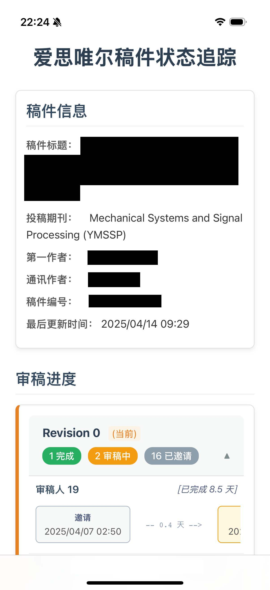

# 📄 爱思唯尔稿件追踪网页版 (Elsevier Review Tracker - Web Version)

<div align=center>

[](#-公共体验地址选项)

</div>

告别浏览器插件的繁琐安装，拥抱清爽的网页体验！本项目旨在利用 Elsevier 官方 API，为您提供一个更直观、更全面、更便捷的稿件审稿进度可视化追踪工具。

**灵感来源 & 参考:**

本项目在实现过程中，参考了 [WL661/Elsevier-Tracker](https://github.com/WL661/Elsevier-Tracker) 项目的部分代码逻辑和思路，并在此基础上构建了纯网页版本，向原作者表示感谢！

## ✨ 项目亮点

*   **📊 可视化追踪:** 以时间线清晰展示每位审稿人的邀请、接受、完成状态及各阶段耗时。
*   **📈 状态总览:** 按 Revision 版本汇总审稿人完成、审稿中、已邀请的数量，审稿进度一目了然。
*   **🌐 网页直达:** 无需安装任何浏览器插件，有网就能用。
*   **🔗 链接驱动:** 只需替换官方查询链接的域名，即可轻松查看。
*   **📱 移动友好:** 支持添加到手机桌面快捷方式，随时随地掌握稿件动态。
*   **📜 基于官方API:** 数据来源可靠，信息更详尽。
*   **↔️ 智能滚动:** 在小屏幕设备上自动启用横向滚动条查看完整时间线，无需担心排版混乱。

## 💻 截图

电脑端视图
<div align=center>

</div>

移动端视图
<div align=center>

</div>


## 🚀 快速上手

使用方法极其简单：

1.  在通讯作者的邮箱中，找到你的 Elsevier 官方稿件追踪链接，它看起来像这样：
    ```url
    https://track.authorhub.elsevier.com/?uuid=xxxxxx-xxxx-xxxx-xxxx-xxxxxxxxxxxx
    ```
2.  将链接中的域名 `track.authorhub.elsevier.com` 替换为我们的[公共体验地址](#-公共体验地址选项)中的任意一个，像这样：
    ```
    https://et.888421.xyz/?uuid=xxxxxx-xxxx-xxxx-xxxx-xxxxxxxxxxxx
    ```
3.  在浏览器中打开修改后的链接，即可开始追踪！

**小贴士:** 你可以将修改后的链接添加到手机书签或“添加到主屏幕”，方便后续快速访问。

## ⚠️ 重要声明：关于隐私与安全

为了获取详细的审稿信息，本项目需要查询 Elsevier 的一个内部 API (`https://tnlkuelk67.execute-api.us-east-1.amazonaws.com/tracker`)。

**然而，由于浏览器的 CORS（跨源资源共享）策略限制，网页无法直接访问该官方 API。**

**解决方案：** 我们部署了一个**中转 API 代理** (`https://et.888421.xyz/cors-proxy?uuid=`) 来绕过这个限制。这意味着当你使用本项目的公共体验地址时：

1.  你的查询请求（包含稿件的 `uuid`）会先发送到我们的中转 API 代理。
2.  中转 API 代理再代替你的浏览器去请求官方 API。
3.  中转 API 代理将获取到的官方数据返回给你的浏览器进行展示。

**潜在风险：**

*   在此过程中，你的稿件 `uuid` **可能会被中转 API 服务器记录**。`uuid` 本身虽然不直接包含密码等敏感信息，但理论上可以通过它查询到你的论文标题、投稿期刊、作者姓名等元数据。

**开发者承诺与免责：**

*   **承诺：** 本项目的开发者承诺，**不会以任何形式主动收集、存储或滥用**通过中转 API 的 `uuid` 数据。中转 API 的部署仅为技术实现所必需。
*   **免责：** 尽管我们尽力保障服务安全，但使用公共中转 API **仍然存在潜在的信息泄露风险**（例如服务器被攻击、Vercel 平台日志等不可控因素）。**开发者不对因使用本项目（特别是公共体验地址）而可能导致的任何信息泄露风险承担责任。**

**🛡️ 更安全的选择：自行部署**

如果你对数据隐私有较高要求，强烈建议你**自行部署** API 代理和前端网页。这样，你的 `uuid` 数据将只经过你自己控制的服务器，从而最大限度地保障信息安全。请参考下面的[【开发与部署】](#️-开发与部署)章节。

---

## 🛜 公共体验地址选项
选择最适合你网络环境的地址，线路互通，可随时切换！
| 线路说明   | 前端访问地址 | API代理地址（无需手动设置） | |
|------------|-------------|-------------|----------|
| **自动** | [https://et.888421.xyz](https://et.888421.xyz) | `https://et.888421.xyz/cors-proxy?uuid=your_uuid` |
| **Cloudflare实例** | [https://et-cf.888421.xyz](https://et-cf.888421.xyz) | `https://et-cf.888421.xyz/cors-proxy?uuid=your_uuid`  |
| **Azure实例** | [https://et-az.888421.xyz](https://et-az.888421.xyz) | `https://et-az-api.888421.xyz/api/proxy?uuid=your_uuid`  |
| **Vercel示例** | [https://et-vc.888421.xyz](https://et-vc.888421.xyz) | `https://et-vc-api.888421.xyz/api/your_uuid`  |

---

## ❤️ 赞助与支持
希望这个工具能为你的科研之路添砖加瓦！🎉  
如果觉得有用，请 Star ⭐️ 项目，也欢迎分享至社交平台帮助更多科研同仁。

**🌟 鼓励自部署+分享！**
如果你有能力自部署前后端，欢迎将你的可用体验地址通过 issue/PR 分享给社区，让更多人受益！

**赞赏支持**
1. 捐赠码：
   <div align="center">
   
   </div>
2. 通过自部署、反馈问题、贡献代码/体验地址等方式支持项目发展。

---

## 🛠️ 开发与部署

想要拥有完全属于你的追踪器？请按以下步骤操作：

### 1. API 代理部署 (可选，但推荐用于生产环境)

此步骤将部署用于绕过 CORS 限制的中转服务器。


*   **方式一：使用 Cloudflare 部署 (推荐)**  
    Fork 本项目，在 Cloudflare Pages 中部署。  
    将自动部署前端和 API 代理（通过Functions）。   
    前端地址类似于： `https://your-project-name.pages.dev`  
    API 代理地址类似于： `https://your-project-name.pages.dev/cors-proxy?uuid=your_uuid`

*   **方式二：使用 Vercel 部署**
    ```bash
    # 进入代理子项目目录
    cd proxy/vercel
    # 执行部署命令
    npm vercel --prod
    ```
    构建完成后，Vercel 会生成一个 API 代理项目，你可以通过路由 `/api/your_uuid` 进行使用，例如 `https://your-proxy-name.vercel.app/api/your_uuid`。

*   **方式三：使用 Azure 部署（较为复杂）**
    ```bash
    # 进入代理子项目目录
    cd proxy/azure
    ```
    使用 VSCode 打开项目，并安装Azure Functions 插件，然后创建一个 Azure Functions 项目。再进行部署

### 2. 网页前端部署（如果第一步选择了 Cloudflare 则无需重复部署）

```bash
# (如果刚才进入了子目录) 回到项目根目录
cd ...

# 打开前端代码文件: src/App.vue
# 找到 apiUrl 常量，将其值修改为你自己部署的 API 代理地址
# 例如: const apiUrl = "https://your-proxy-name.vercel.app/api/";
```

修改完 `apiUrl` 后，你可以选择以下方式部署前端网页：

*   **方式一：使用 Vercel 部署 (推荐)**
    ```bash
    # 在项目根目录运行
    vercel --prod
    ```
    Vercel 会自动构建和部署，并提供一个生产环境 URL。

*   **方式二：本地开发环境运行**
    ```bash
    # 安装依赖
    npm install

    # 启动本地开发服务器 (通常在 http://localhost:5173)
    npm run dev
    ```

*   **方式三：打包后自行部署**
    ```bash
    # 安装依赖
    npm install

    # 执行构建命令
    npm run build
    ```
    构建完成后，会在 `dist` 目录下生成静态文件。你可以将 `dist` 目录下的所有内容部署到任何静态文件服务器上（如 Nginx, Apache, GitHub Pages 等）。
